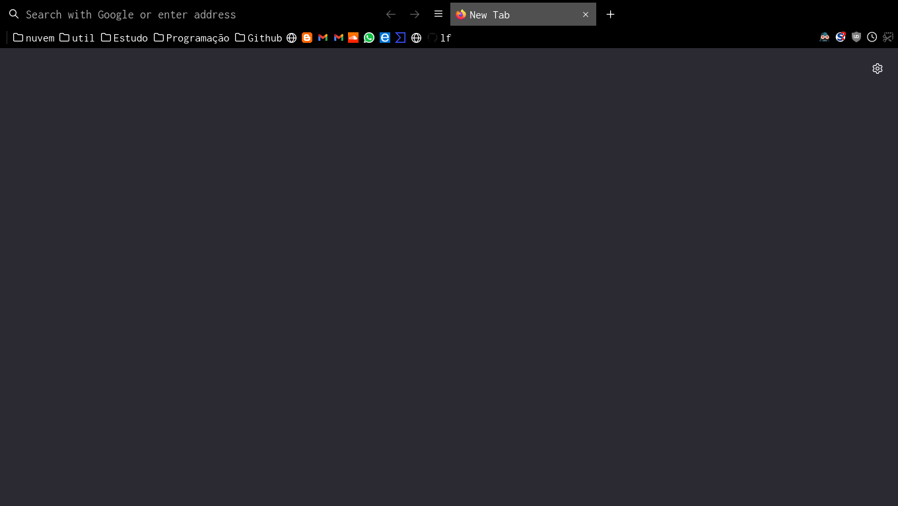

# userChrome.css

**Minha barra do firefox customizada**

## Habilitar userChrome

### Para habilitar o userChrome abra o firefox e va para a pagina about:config > clique em continuar > procure por userProfile > clique duas vezes na primeira opção marcando ela como true

## Pasta chrome

**cria a pasta chrome caso ela não exista e copie o userChrome.css, o local desta pasta varia dependendo do seu sistema operacional**

**O seu profile pode ter muitos nomes, Para saber o seu profile atual ou ir diretamente ate o diretorio abra firefox MENU > AJUDA > MAIS INFORMAÇÕES > ABRIR DIRETORIO**

- Windows
  - C:\Users\\"Usuario"\AppData\Roaming\Mozilla\Firefox\Profiles\"Profile"\chrome\userChrome.css

- Linux
  - /home/"Usuario"/.mozilla/firefox/"Profile"/chrome/userChrome.css

- macOS
  - /Users/"Usuario"/Library/Mozilla/"Profile"/chrome/userChrome.css
